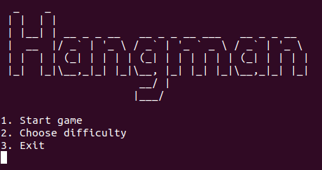
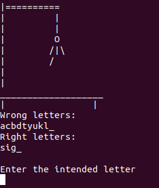

# Игра Hangman

Курсовой проект

# О проекте
Консольной приложение, разработанное для OC Linux. 
Компьютерная игра Hangman с псведографикой.

# Запуск приложения

   * $ make run
# Запуск тестов

   * $ make runtest

